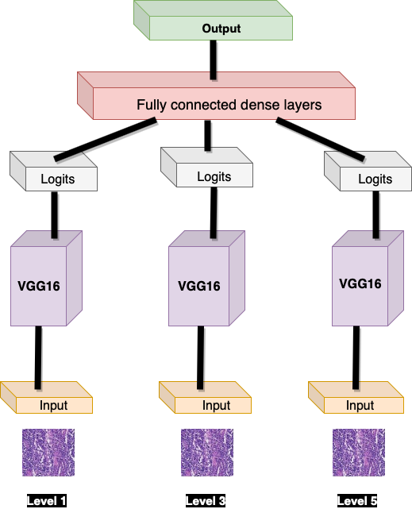
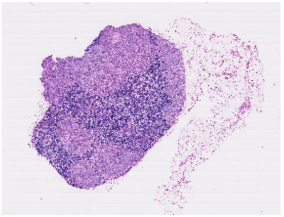
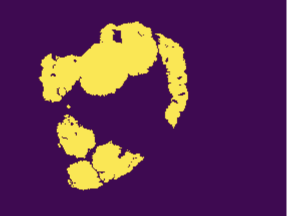
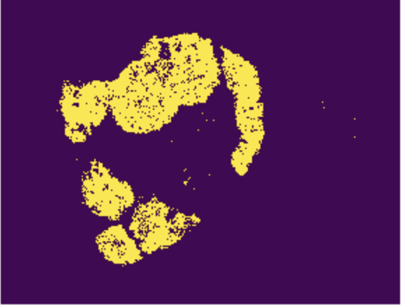
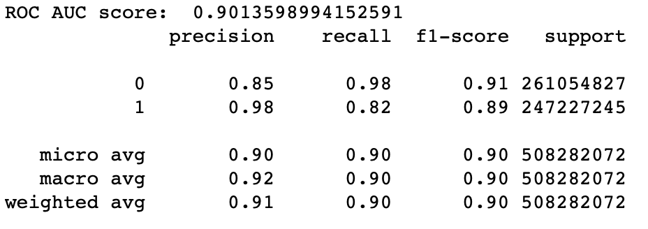

# Detecting Cancerous cells in Gigapixel images

This repository consists the code for our Deep Learning approach to automate the detection and classification of breast cancer metastases in whole-slide images of histological lymph node sections. The presence of metastases in lymph nodes has therapeutic implications for breast cancer patients. Therefore, an automated solution would hold great promise to reduce the workload of pathologists while at the same time reduce the subjectivity in diagnosis.

The slides for the project can be obtained [here](https://drive.google.com/file/d/1C6jb9S7DRgW0rdnh2RRhpzaHGcGZCUoP/view?usp=sharing), and the YouTube video can be watched [here](https://www.youtube.com/watch?v=3lGm_lpxsUk&feature=youtu.be)

## Files
To run the entire code end-to-end, you will need the following three files:
1) main_code.ipynb: This file contains the end-to-end code which trains and tests various slide images.
2) loading_data.py: Helper file which is used for evaluation and testing
3) train_test_save.py: Helper file used during training and testing

## Dependencies

To install all the dependencies for this project, run the following commands:
```
apt-get install openslide-tools
pip install openslide-python
pip install opencv-python
pip install tensorflow-gpu
pip install numpy
pip install scikit-learn
pip install pandas
pip install seaborn
pip install matplotlib
```

## Running the code

The entire code was developed to run on both, Google Colab and Google Cloud Platform. The zoom levels in order for the code to run on Google Colab has to be > 2. As the levels 1 and 0 produce many images, and it would exceed the memory capacities on Google Colab.

This code was run on Google Cloud Platform with levels 1, 3 and 5. The configuration of the instance was 16CPUs, 104 GB RAM, 100 GB Storage, 1 NVIDIA Tesla P100 GPU with 16 GB RAM.

## Architecture of the Model

We implemented a parallel architecture to create our model. The parallel architecture consists of 3 seperate models which are trained on 3 seperate zoom levels for each slide image. These slides are then passed through the pretrained CNN, VGG16, and the output logits are concatenated. These logits are then passed through the fully connected layers, and finally we receive the output at the final layer. We decided to use a parallel architecture with multiple zoom levels, as we would then obtain rich features from the images, with information about the neighboring cells.



## Output

We used various metrics like Accuracy, F1-score, Precision, Recall values, and ROC-AUC to determine how well our model performed on the test data.
The  results we obtained on testing our model on one of the slide image is presented below:

###  Original slide image:



### Expected Tumor Mask



### Predicted Tumor Mask



### Classification report and ROC-AUC




## Contributors
This project was developed by [Siddhant Gada](https://www.github.com/SiddhantGada), [Sukriti Tiwari](https://github.com/sukriti10) and [Neha Arora](https://github.com/neha-arora-root)
